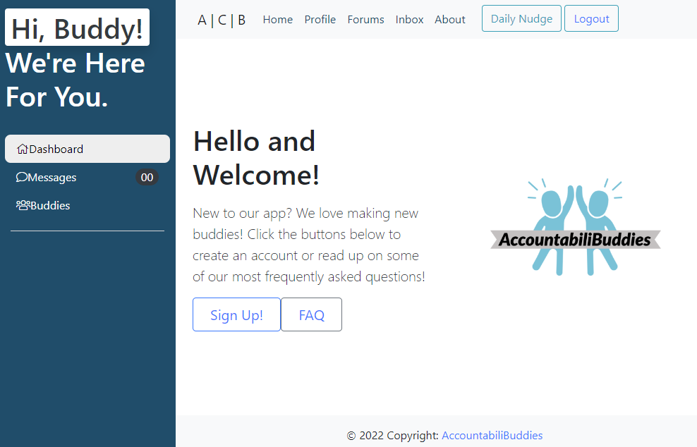
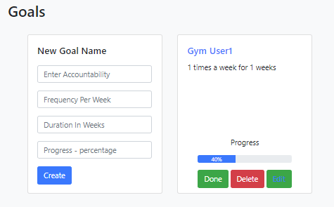
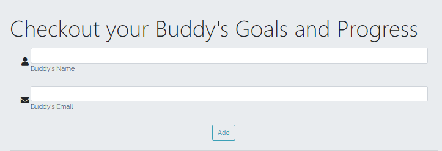

# AccountabiliBuddies

# Description

AccountabiliBuddies is an online space for individuals to semi-anonymously connect with others working towards a common goal. We strive to create a safe environment which encourages support and camaraderie amongst individuals seeking to eliminate harmful habits and/or hold themselves accountable to accomplish their goals. With initial sign up, the user is paired with a "Buddy", and the two are able to check in with one another and share their progress daily. 

# Mission 
Our Mission here at AccountabiliBuddies is to create an online environment that promotes community amongst individuals working towards commons goals. 

# Usage
This application enables the user to create personal goals and save them on their profile. Once logged in, the user also has access to the buddies page, where you can check other user's goals and progress.

## Preview

 

# Features:

Homepage 

1. Top Navigation Bar with the following options: Home, Profile, Forums, Inbox, and About.
    - There are also two buttons which allow the user to login and access the "Daily Nudge" 

2. Hero section with buttons leading to the FAQ page and the Sign Up page. 

3. Sidebar that offers a number of features available to users that have logged in. 
These include: 
 - Dashboard access, 
 - Inbox access
 - Buddy page - the user has access to other user's goals and progress 
 - Messages - the ability to post and delete personal messages

## User Page:

1. Profile section that allows the user to display personalized info pertaining to their goal(s). 

2. A list of achievements/trophies that the user has earned based on their individual progress. 

3. A "Goals" section that allows the user to create new goals. Among the questions asked for the goals include: 
    - Naming the goal.
    - The frequency to which that goal should be followed in a week.
    - The number of weeks the user would like to commit for this goal.
    - The progress the user has had holding themselves accountable to the prospective goal.
 

## Buddies Feature: 

The Buddies page shows goals information from other users. Once the user input's another user's name and email, it will send a POST request. If the user exists in the database, then all their goals' information will be displayed. 
 

## License
  
  
  This application is covered by MIT license, available at:
  https://opensource.org/licenses/MIT

 ## Contributing
  Please feel free to send a pull request, the following is my GitHub account: 
  https://github.com/Renatatims

  ## Tests
  Please make sure the inquirer is installed. Once the node_modules are downloaded, then you can run the application by typing 'node server' in the terminal, or npm start.

  ## Questions
  If you have any questions please contact me at:
   - GitHub account:https://github.com/Renatatims
   - e-mail account: renatatims@gmail.com

  ## Credits
  This application was built by the following users:
  - Hayley Briggs - https://github.com/Briggoh
  - James Arenella - https://github.com/jarenella
  - Michael Corbo - https://github.com/mrcorbo
  - Renata Rondon - https://github.com/Renatatims

  ## Sources
   https://www.npmjs.com/package/mysql2 / https://www.npmjs.com/package/inquirer/v/8.2.4
 

